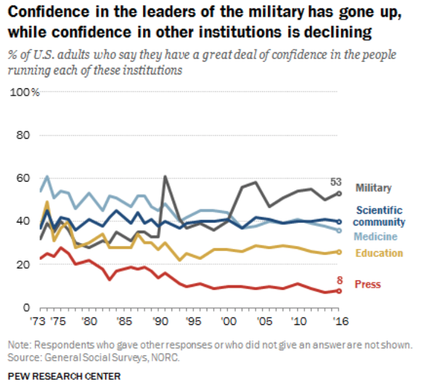

% Kako prepoznati predatorske izdavača?
% Radionica za mentore, 7. veljače 2019.
% Franjo Pehar, Odjel za informacijske znanosti

# Kako prepoznati predatorske izdavače? v0.1

## Radionica za mentore, 7. veljače 2019.

### Franjo Pehar, Odjel za informacijske znanosti

---

# Razrada radionice

1. Uvod
2. Ekosustav i prehrambeni lanac
3. Kako prepoznati grabežljivce?
4. Oružje i oruđe za borbu protiv grabežljivaca
5. Zaključak

- trajanje: 120 - 150 minuta

---

# Cilj i svrha radionice

- cilj: upoznati potencijalni "plijen" s različitim vrstama grabežljivih izdavača, prepoznati načine njihova djelovanja i u skladu s naučenim razviti učinkovite obrambene mehanizme  
- svrha: podići razinu svijesti o složenosti sustava znanstvene komunikacije i važnosti uspostavljanja i pridržavanja etičkih normi i standarda na kojima, između ostalog, počiva sustav znanosti

---

# Uvod

- slični problemi i rasprave kao danas muče znanost sto/deset/ljećima, a naročito posljednjih 50-ak godina
- počeci recenzijskog postupka 1752. > Royal Society of London preuzeo fiskalnu odgovornost nad Philosophical Transactions
  - članovi Udruženja preuzeli ulogu recenzenata
  - ustoličeni proces donošenja odluka: urednik, uredništvo, vanjski (neovisni) eksperti
- recenziranje nije ušlo u standardnu primjenu do druge polovice 20. stoljeća (Diana Crane, 1967 ; Harriet Zuckerman i Robert K. Merton, 1971.)
  - terminologija: refereeing | gatekeeping ; (dvostrukoslijepa) slijepa recenzija

---

# Propitkivanje (stabilnosti) postavljavenih standarda

- rasprave usmjerene na anonimnost, evaluacijske standarde i pouzdanost recenzije/recenzenata
  - prvi eksperimenti usmjereni na provjeru stabilnost recenzijskog sustava
    - Peter i Ceci 1982. promijenili podatke 12 članaka američkih psihologa i poslali radove istim časopisima > rezultat: samo 3 od 12 radova (raz)otkriveno ; 8 od 9 odbijeno (metodološki nedostaci)!
- institucijski diktat objave u recenziranim časopisima
- globalna znanstvena agenda "publish or perish"
- "kriza znanstveno izdavaštva"
  - Benjamin Singer (1989.) u raspravi o "akademskoj krizi" navodi: 
  
  "the formal control institutions and technologies that were designed to maintain standards have actually begun to encourage their decline"

---
# Neki od poznatijih eksperimenata i "prankovi"

- [Alan Sokal ili Social Text afera/haox](https://en.wikipedia.org/wiki/Sokal_affair)
- [Bohannonov eksperiment](https://en.wikipedia.org/wiki/John_Bohannon)
- ['Dr Fraud' eksperiment](https://www.nature.com/news/predatory-journals-recruit-fake-editor-1.21662)
- VIDEA konferencija 
- [SCIgen/erator radova](https://pdos.csail.mit.edu/archive/scigen/)
  - preko [120 radova](https://en.wikipedia.org/wiki/Predatory_open-access_publishing) završilo u IEEE i Springerovim publikacijama!
    - reverse engineering (obrnuti SciGen)

---
## ... nekoliko zanimljivih "prankova"

- "Testing Inter-hemispheric Social Priming Theory in a Sample of Professional Politicians-A Brief Report"

  <iframe src="../03_primjeri_radova/Gerry+Jay+Louis+hoax+paper.pdf" width="800" height="500"></iframe>

---

## ...

- "Get me off Your Fucking Mailing List"

  <iframe src="../03_primjeri_radova/remove.pdf" width="800" height="500"></iframe>

---
# Žito i kukolj

- kontinuitet rasprava usmjerenih na način odvajanja žita od kukolja
  - većina usmjerena na KAKO a na ZAŠTO (način provođenja kontrole kvalitete a ne svrha)
    - razlikovanje znanosti od pseudoznanosti, znanstvenih od pseudoznanstvenih publikacija
    - provjera vrijednost rukopisa u odnosu na (opće)prihvaćene znanstvene standarde
    - osigurati da je rad znanstveno zanimljiv
    - provokativne slike urednika/recenzenata: policajci, suci, branitelji, reinkarnacija velikog inkvizitora
    - smanjenje broja objavljenih članaka i svođenje na upravljivu količinu
    - pomoć pojedinicima: smanjuje se odgovornost urednika i pritisak na uredništvo ; štiti literaturu od pogrešaka ; čuva čitatelje ; educira autore ; poboljšava istraživanja ; ...
  - ograničenja i kritika
    - neučinkovit sustav otkrivanja falsiciranih/friziranih podataka
    - anonimnost dionika
    - ...

---

# Zašto je današnja tema važna?

## Povjerenje javnosti u sustav znanosti

- longitudinalno istraživanje koje svake dvije godine provodi GSS (General Social Surveys) NORC prikazuju stalno prisutan visok stupanj povjerenja sjevernoameričke javnosti u znanost
(URL: https://gssdataexplorer.norc.org/trends/Politics?measure=consci)

- sustav znanost i znanstvene komunikacije su ljudske institucije, a samim tim i društene i političke (okvir unutar kojeg treba promatrati i istraživati sve procese i aktivnosti!)

---
# Predatorsko izdavaštvo

Otvaramo sezonu lova na grabežljivce! 

  "grabežljivac, mesožderna životinja koja se nalazi na vrhu ili pri vrhu prehrambenoga lanca. Kada grabežljivac i plijen duže vrijeme žive u istom **ekosustavu**, plijen se navikne na prisutnost grabežljivca. Ubijajući najslabije jedinke grabežljivac, naime, pomaže u održanju kakvoće populacije plijena. Vrhunski je grabežljivac (engl. top predator) životinja koja više nema prirodnog neprijatelja, npr. lav, tigar, vuk, ris" (URL: http://www.enciklopedija.hr/natuknica.aspx?id=22919)

---

# Pojava predatorskog izdavaštva: kontekst

- ekosustav: znanost
- aktivnost: znanstvena komunikacija, odnosno zadnja faza znanstveno-istraživačkog rada [^1]
- dionici: autori, čitatelji (znanstvenici/javnost), izdavači (urednici, lektori, korektori), recenzenti, "startupovi", ...
- izazov trenutka: disruptivni procesi izazvani tehnološkim napretkom utjecali na transformaciju tradicionalnog sustava znanstvene komunikacije
  - sustav koji je trebao polučiti najveću izravnu korist od teh. napretka suočen s "nepremostivim" izazovima
  - najugroženiji: kontrola kvalitete, provjera vjerodostojnosti i izvornosti
- analogija s prirodnim svijetom samo djelomično funkcionira u pogledu ponašanja dionika (predatora/plijena), ali ne i u pogledu prirodne selekcije i ravnoteže (ishodi više nalik svijetu (mikr)oorganizama > bakterije, virusi, paraziti)

[^1]:   *veliki problem: znanstvena komunikacija se (pre)često analizira odvojeno od znanstvenih politika, društvenih struktura i mreža te ostalih faza znanstveno-istraživačkog rada*

---

# Pojava predatorskog izdavaštva: placenta ili ferment 

1. mnogobrojni nedostaci tradicionalnog znanstveno-komunikacijskog lanca
  - uređivačka politika
    - dugačak period od predaje do objave rada
    - protežiranje autora s "globalnog sjevera"
      - 1/4 svjetskog stanovništva, 4/5 prihoda od industrijske proizvodnje 
  - recenzijski postupak
    - dugotrajan i netransparentan postupak
    - bez alternative > neznatna poboljšanja i primjeri dobre prakse više kao iznimka
  - "publish or perish" ili diktat objave
2. razvoj i dostupnog tehnologije brze pripreme, objave i distribucije sadržaja
3. Pojava i razvoj OTVORENOG PRISTUPA (OA)
  * novi poslovni modeli (*gratis, libre, zeleni put, zlatni put, platinasti ili dijamantni, hibridni* ...)

---

## Naplaćivanje objave u OA časopisima
- razne publikacije (časopisi/konferencije/zbirna djela/knjige) naplaćuju autorima tzv. ‘Article Processing Charges’ (APC)
- 2.900 USD za PLoS Biology
- 2.250 USD za PLoS Genetics
- 1.350 USD za PLoS One*

*PLoS One objavljuje dnevno cca 100 članaka!

### Predatori namirisali ogromnu mogućnost zarade

- ali i svi veći (tradicionalni) izdavači OA znanstvenih časopisa!

---

# Terminologija

- "predatory publishing" skovao [Jeffrey Beall](https://en.wikipedia.org/wiki/Jeffrey_Beall) (->)
  - analogija:  ["predatory journal"](https://en.wikipedia.org/wiki/Predatory_open-access_publishing)
  - ostali pojmovi u upotrebi: 
    - fake journal | illegitimate journals | deceptive journals | "dark” journals | journals operating in bad faith ...
    - junk conferences | spamferences | bogus conferences | fake conferences ...
    - vanity books ... *
- brojni pojmovi dodatno utječu na zbunjenost znanstvenika i ostalih dionika
- problem: pojednostavljena binarna klasifikacija znanstveno-komunikacijskog okoliša na **PREDATORE** i **NEPREDATORE**
   - potreba za razlučivanjem publikacija **"niske kvalitete"** od ponašanja koje ciljano **zanemaruje i krši** uspostavljene znanstvene norme i standarde

* [primjer LAP LAMBERT](http://www.slate.com/articles/technology/future_tense/2014/03/lap_lambert_academic_publishing_my_trip_to_a_print_content_farm.single.html?via=gdpr-consent)

---

# Definicije

- Predatorski časopis je [...]
- Predatorska konferencije je [...]
- Predatorski izdavač je [...]

**Postojeće strukture onemogućuju jednoznačno određenje "predatora"!** - naslućivanje, pretpostavljanje, nagađanje, ...

### Pedeset nijansi sive predatorskog izdavaštva 
  
  "a grey zone where it is difficult to decide whether or not a publisher is predatory, particularly for newcomers for whom there is still a lack of evidence."
---
# Predatorski izdavači/časopisi

Neka obilježja: 

- izdavači koji objavljuju OA časopise upitne kvalitete
- autori plaćaju objavljivanje radova
- slabašna ili nepostojeća recenzija – prihvaćaju sve radove uz uvjet plaćanja objave
- nepostojeći ili lažni glavni urednik ili urednički odbor
- uz imena urednika, recenzenata i sl. nema podataka o njihovom akademskom statusu (lažni status/afilijacija)
- više časopisa ima isti urednički odbor
- izdavač u isto vrijeme pokreće izdavanje velikog broja časopisa
- naslov časopisa nema veze sa sadržajem koji objavljuje ; široko postavljeni naslovi (npr. *Journal of Science/s*)
- nelogičnosti u naslovu časopisa (npr. Canadian journal..., a nema veze s Kanadom)
- lažni IF (impact factor) ili podatak o indeksiranosti u relevantnim bazama podataka
- izdavač šalje spam mailove (s pozivima za objavljivanje radova, pozivima za recenzente, gostujuće urednike i sl.)
- ... "kreativna industrija", "režu" gdje smo "najtanji"
---

# Predatorske konferencije

- konferencije kojoj je jedini motiv laka i brza zarada
- često "surađuju" s predatorskim časopisima (npr. https://www.omicsonline.org)

Neka obilježja (pogledati video na kraju! pt): 

- obično vrlo široko definirana tematika koju pokriva
- atraktivna lokacija (grad) ; zvučni hoteli (u pravilu manje dvorane)
- visoka kotizacija
- nedostatak akademske afilijacije
- predatorska marketinška taktika
- nepostojeći dokazi kontrole kvalitete

---

# Odabrani primjeri

## Krađa identiteta etabliranih časopisa

[**Izvorna publikacija**](http://www.landesmuseum.ktn.gv.at/210226w_DE.htm?seite=15)

  <iframe src="http://www.landesmuseum.ktn.gv.at/210226w_DE.htm?seite=15" width="800" height="500"></iframe>

---

## Krađa identiteta etabliranih časopisa

[**Surogat**](http://www.multidisciplinarywulfenia.org/index.html)

  <iframe src="http://www.multidisciplinarywulfenia.org/index.html" width="800" height="500"></iframe>

---
## Oteti identiteti ...

Časopis *Jökull: Journal of Earth Sciences* (ISSN 0449-0576)> http://jokulljournal.is

  <iframe src="http://jokulljournal.com" width="800" height="300"></iframe>

---
## Lažno predstavljanje 

[Lažni članovi uredništva, Impact Factor](https://www.academicresearchjournals.org/IJEBM/Index.htm) ...

  <iframe src="https://www.academicresearchjournals.org/IJEBM/Index.htm" width="800" height="500"></iframe>

---
## Lažirani podaci i rezultati

[Lovci u mutnom, prevaranti, hohštapleri](https://www.tandfonline.com/doi/abs/10.4161/onci.25769) ...
- slučaj [Davida Noakesa](https://en.wikipedia.org/wiki/David_Noakes) i GcMAF 

  <iframe src="https://www.ncbi.nlm.nih.gov/pmc/articles/PMC3812199/" width="800" height="500"></iframe>

---
## Hiperprodukacija i fabriciranje knjiga

- karijeristi ...
- slučaj [Wadima Strielkowskog](../razno/predatory-publishing.pdf)

- https://www.amazon.com/Sam-Vaknin/e/B000APLOFK

- obično Google pretraživanje: ["Sam Vaknin" + journal editor](https://www.google.com/search?client=safari&rls=en&q=%22Sam+Vaknin%22+journal+editor&ie=UTF-8&oe=UTF-8)

1. odvodi nas do ["El Dorada"](http://innovationinfo.org/index.php/journal/Editor_in_Chief/Dr-Sam-Vaknin)
2. [i još zanimljivijih rezultata](https://groups.google.com/forum/#!msg/narcissistic-personality-disorder/-yAlT779G3o/sJgRvHGrAgAJ) 
---

## Publikacijske farme

  <iframe src="https://www.omicsonline.org" width="800" height="500"></iframe>

- https://asclepiusopen.com
- http://gslpublishers.org/index.php
- https://innovationinfo.org

[WHOIS?](https://whois.icann.org/en/lookup?name=asclepiusopen.com)

---

## Konferencijske farme
- izravno povezani s predatorskim izdavačima (časopisa)
  - https://www.conferenceseries.com
  - http://meconferences.com
  - https://www.heartconferences.com

[WHOIS?](https://whois.icann.org/en/lookup?name=www.heartconferences.com) 

Registrant Contact 
Name: GDPR Masked 
Organization: GDPR Masked 
Mailing Address: GDPR Masked GDPR Masked GDPR Masked, GDPR Masked GDPR Masked 00000 GDPR Masked 
Phone: +0.00000000 
Ext: 
Fax: 
Fax Ext: 
Email:gdpr-masking@gdpr-masked.com 

---
# Oružje i oruđe za borbu protiv grabežljivaca

### Objavljeni popisi grabežljivaca > "Index Librorum Prohibitorum"

Najpoznatiji Beallov popis predatorskih izdavača (2008-2017)
- ukazao na brojne probleme > (ne)opravdano na udaru žestokih kritika i prijetnji tužbama

  <iframe src="https://beallslist.weebly.com" width="800" height="500"></iframe>

---
# Ostali popisi 

### Cabellov crni i bijeli popis

- [popis kriterija](https://www2.cabells.com/blacklist-criteria) u [XLS-u](cabellovi_kriteriji.xlsx): Integrity, Peer Review, Website, Publication Practices, Indexing & Metrics, Fees, Access & Copyright, Business Practices > iskorak u odnosu na Beallov popis, ali ...
  - lovina postala lovac
  - problem *false negatives* vs *false positives* > logički gledano skup nikada ne može biti potpun!

  <iframe src="https://www2.cabells.com" width="800" height="300"></iframe>

---
# Alternativa postojećim popisima

- konkretniji kriteriji, (složeniji) bodovni sustav, ponderiranje kriterija i sl.

- [Journal Evaluation Tool](../razno/JournalEvaluationTool.pdf)
- [Predatory Score](../razno/predatory_score.pdf)
- ...

  <iframe src="../razno/predatory_score.pdf" width="800" height="300"></iframe>

---

# Ostala dostupna pomagala

- računalna forenzika
  - WHOIS (provjera vlasnika domena)
  - Google Maps (provjera fizičkih adresa)
- pretraživanje weba (primjer [Sam Vakinin](https://www.google.com/search?client=safari&rls=en&q=%22Sam+Vaknin%22+journal+editor&ie=UTF-8&oe=UTF-8))
- pretraživanje baza podataka
  - selektivne, opće (provjera deklarirane indeskiranost/citiranosti)
  - JCR, Scimago ... (provjera deklariranih metričkih vrijednosti)
- https://retractionwatch.com
  - slučaj Springera iz 2014. ukazuje da i renomirani izdavači imaju problem s osiguravanjem kvalitete i vjerodostojnosti objavljenih radova (https://paperpile.com/blog/springer-fake-papers/)
- provjera zaglavlja (spam) e-pošte (preusmjeravanje, skrivanje pravog identiteta ...)
- [...]
---

# Najbolji "lijek": podizanje razine svijesti

- poznavanje znanstvenog ekosustava i ključnih (su)dionika u vlastitom području, polju, grani, domeni/specijalizaciji
- razgovor i savjetovanje s (iskusnijim) kolegama
- beskompromisno pridržavanje visokih normi i standarda vlastite znanstvene produkcije
- postavljanje letvice iznad razine pragme
  - npr. odabrati tri ciljna časopisa (vrh, sredina, niži srednji ili viši donji prag)
  - ovisno o odluci uredništva ili preporuci recenzenata ispraviti rad ili poslati u drugi časopis ...

---

# Sublimirano u: Think - Check - Submit

  <iframe src="https://thinkchecksubmit.org" width="800" height="600"></iframe>

---

# Umjesto zaključka

### Jedna životna priča

- pseudoznanost i lažni podaci nanose izravnu štetu znanosti i umanjuju povjerenje u rezultate znanstveno-istraživačkog rada

  <iframe src="https://www.daserste.de/information/reportage-dokumentation/dokus/videos/exclusiv-im-ersten-fake-science-die-luegenmacher-video-102.html" width="800" height="600"></iframe>

---

# Zadatak

1. Na temelju [priloženih kriterija](../cabellovi_kriteriji.xlsx) vrednujte sljedeće časopise:

  * http://www.eajournals.org/journals/international-journal-of-asian-history-culture-and-tradition-ijahct/
  * http://www.macrothink.org/journal/index.php/ijch
  * http://acascipub.com/International%20Journal%20of%20History%20and%20Culture/International%20Journal%20of%20History%20and%20Culture.php
  * http://5thpublisher.com/index.php/jaht
  * http://www.scholink.org/ojs/index.php/jrph
  * http://www.academicresearchjournals.org/ARJPC/Index.htm
  * http://gslpublishers.org/journals/index.php?title=gsl-journal-of-business-management-and-administration-affairs
  * https://juniperpublishers.com/ofoaj/
  * https://www.bioinfopublication.org/journal.php?opt=azjou&jouid=BPJ0000210
  * http://www.eajournals.org/journals/international-journal-sociology-anthropology-research-ijsar/
  * https://www.arcjournals.org/international-journal-of-research-in-sociology-and-anthropology
  * http://ambitjournals.org/ajgrp
  * https://www.sryahwapublications.com/annals-of-geographical-studies/
  * http://didacticjournals.org/djgrp/index.php
  * https://www.arcjournals.org/international-journal-of-research-in-geography
  * http://www.sciepub.com/journal/SEG
  * https://premierpublishers.org/irjcp
  * http://www.amitdeliberativeresearch.com/2017/01/19/international-journal-of-relevant-derive-2/
  * https://www.arcjournals.org/international-journal-of-media-journalism-and-mass-communications

